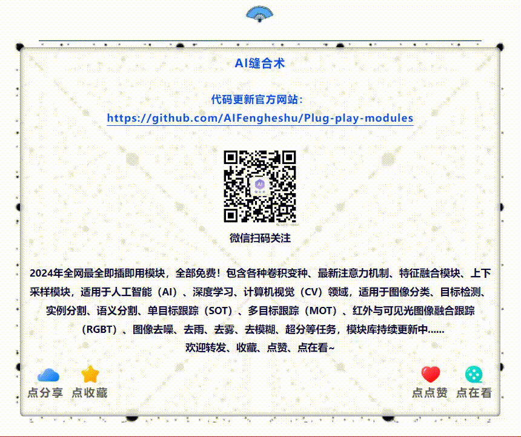

## 最新更新请关注微信公众号【AI缝合术】

## Plug-play-modules（即插即用模块）
2024年全网最全即插即用模块，包含各种卷积变种、最新注意力机制、特征融合模块、上下采样模块，适用于AI人工智能、深度学习、计算机视觉CV领域，适用于图像分类、目标检测、实例分割、语义分割、单目标跟踪（SOT）、多目标跟踪（MOT）、红外目标跟踪（RGBT）、图像去雨、去雾、去模糊、超分等任务，持续更新中......
# 论文解读
### 1. [可变形卷积 (CVPR 2019) DCNv2.py](https://github.com/AIFengheshu/Plug-play-modules/blob/main/(CVPR%202019)%20DCNv2.py)
题目：Deformable ConvNets v2: More Deformable, Better Results

地址：https://arxiv.org/pdf/1811.11168

论文解读：[可变形卷积（DCNv2），即插即用，直接替换普通卷积，助力模型涨点！增强网络特征提取能力！](https://mp.weixin.qq.com/s/ptGGWtCmsJqxKLGAbYHwLA)

### 2. [小波卷积 (CVPR 2017) DWConv.py](https://github.com/AIFengheshu/Plug-play-modules/blob/main/(CVPR%202017)%20DWConv.py)

题目：Deformable ConvNets v2: More Deformable, Better Results

地址：https://arxiv.org/pdf/1811.11168

论文解读：[【ECCV 2024】大感受野的小波卷积，即插即用，显著提高CNN的有效感受野](https://mp.weixin.qq.com/s/I3Qh1yPWbr9sqEql1DAsjg)
